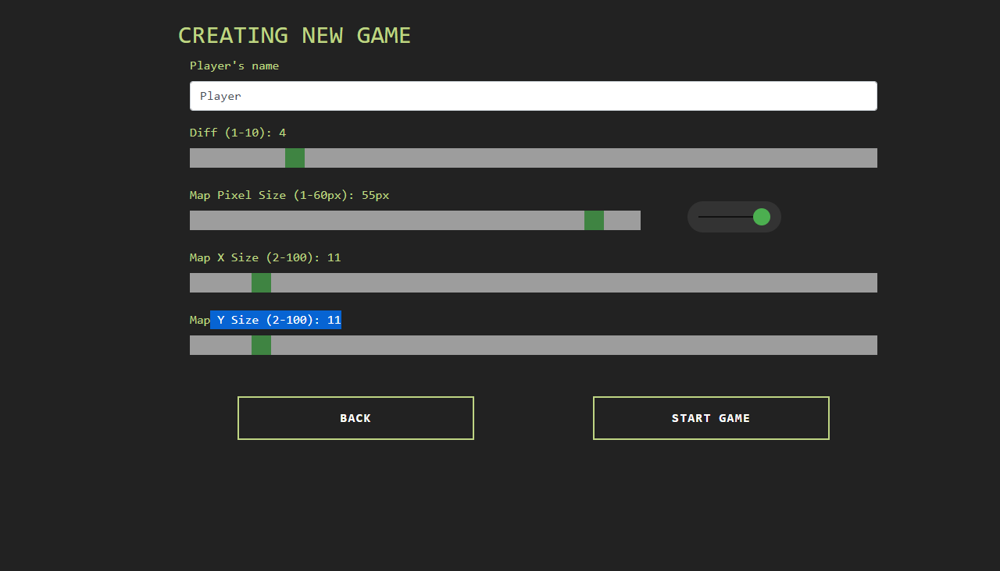

## Demo

Gameplay: 

[Start the game](https://bartag512.github.io/snake-game/client/)

### Installation

`npm install`

### Start start on a local server

`node app.js`

open in browser: http://localhost:3001/

### Features
- Score system
- Levels with increasing difficulty
- Game settings
  - player name
  - map size
- Highscore by map size

### Controls
Can be played with gamepad or keyboard.

Keys:
	`W` - up
	`A` - left
	`S` - down
	`D` - right
	`space` - pause/resume game
	
	
### Preview

Settings: 
